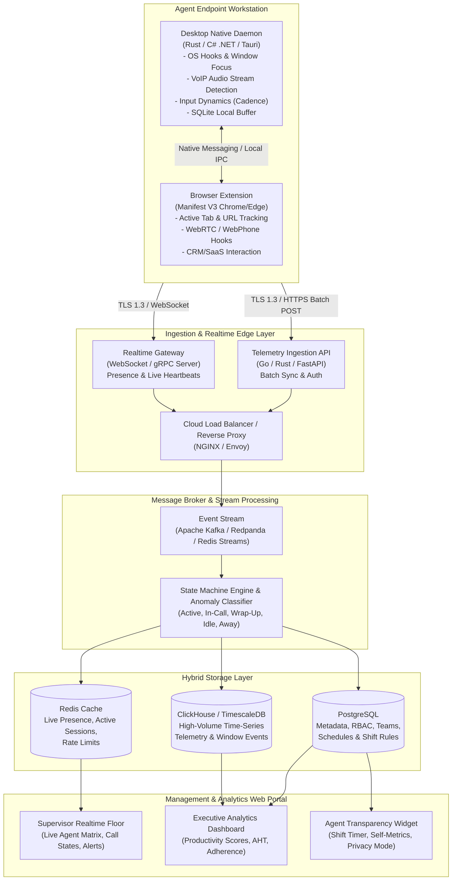
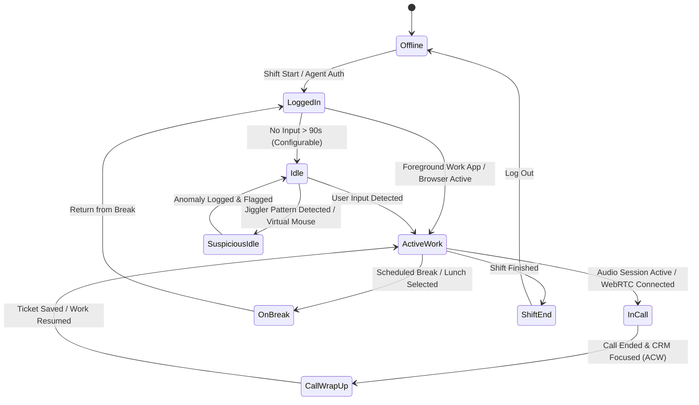
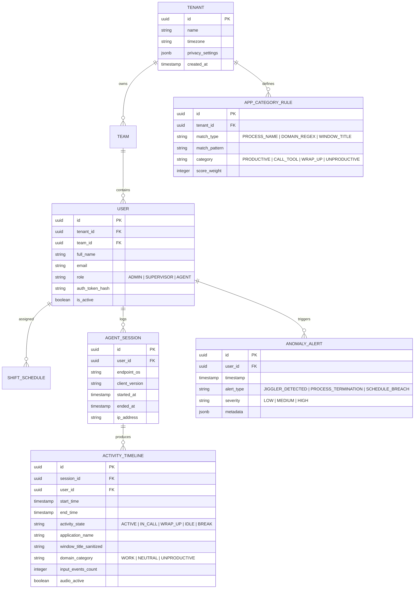
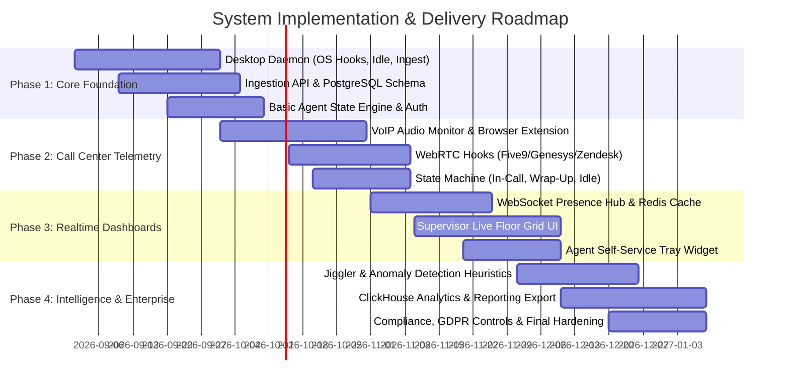

# Remote Workforce & Call Center Performance Tracking System
## Architecture & Technical Design Specification

---

### Executive Summary

This document defines the end-to-end software architecture for an enterprise-grade **Remote Workforce Performance & Activity Intelligence Platform**, specifically tailored for distributed call center agents, customer support teams, and browser/desktop-heavy remote knowledge workers.

The system solves the dual challenge of:
1. **Accurate, tamper-resilient productivity tracking** across desktop softphones, web-based CRMs, ticketing systems, and browsers.
2. **Privacy-conscious, real-time operational visibility** for supervisors, while maintaining strict adherence to compliance standards (GDPR, CCPA, SOC2, HIPAA).

---

## 1. System Vision & Design Principles

```
+-----------------------------------------------------------------------------------+
|                                CORE PRINCIPLES                                    |
+---------------------+-----------------------+------------------+------------------+
|  1. Minimal Footprint|  2. Privacy by Design | 3. Offline-First |  4. Sub-Second   |
|   < 40MB RAM client |    Zero keylogging,   |  Local spooling  |   Live Presence  |
|   < 1% CPU usage    |    PII sanitization   |  resilience      |   Supervision    |
+---------------------+-----------------------+------------------+------------------+
```

1. **Lightweight & Non-Intrusive**: Endpoint agents must run with near-zero impact on agent workstation performance (no audio glitches in VoIP calls, no UI stuttering).
2. **Context-Aware Call Center Telemetry**: Distinguish between general idle time vs. active call engagement, VoIP audio streams, CRM note-taking (wrap-up time), and scheduled breaks.
3. **Tamper & Anomaly Resistance**: Built-in detection for mouse jigglers, macro scripts, virtual machine sandboxing, and clock tampering.
4. **Resilient & Offline-First**: Network drops must never cause data loss; endpoint buffering with transactional sync.
5. **Real-time Event-Driven Pipeline**: Sub-second synchronization between agent actions and supervisor live floor displays.

---

## 2. High-Level System Architecture



---

## 3. Subsystem Breakdown

### 3.1. Endpoint Client Subsystem

The endpoint layer combines a **Desktop Native Daemon** and a **Browser Companion Extension** to obtain a holistic 360° view of agent work without invasive screen recording.

#### A. Desktop Tracking Agent (Native Daemon)
* **Technology Choice**: **Rust** (preferred for maximum memory safety and minimal RAM footprint ~15MB) or **C# .NET 8 / WinUI** (for native Windows API hooks).
* **Core Responsibilities**:
  1. **Foreground Window Monitor**: Uses OS hooks (`GetForegroundWindow`, `GetWindowText`, `GetWindowThreadProcessId` on Windows; CoreGraphics/Accessibility on macOS) polled at dynamic intervals (1–2 seconds).
  2. **Human Input Dynamics**: Captures aggregated input frequency (keystroke count rate and mouse velocity vectors). **Strictly zero keystroke logging / key recording** to prevent capturing passwords and customer credit cards.
  3. **Idle & Inactivity Engine**: Leverages `GetLastInputInfo` to track hardware-level idle time down to the millisecond.
  4. **VoIP & Audio Stream Activity Monitor**: Uses Windows Core Audio APIs (`IAudioSessionManager2`, `IAudioSessionEnumerator`) to detect whether communication apps (e.g., Avaya, Genesys, Cisco Jabber, 3CX, Teams) are actively capturing/rendering audio streams.
  5. **Anti-Fraud & Jiggler Detector**:
     - Analyzes mouse trajectory curvature, acceleration variance, and repetitive linear micro-movements.
     - Detects virtualized input hardware injection and synthetic event flags (`LLMHF_INJECTED`).
  6. **Offline Storage & Sync Engine**: Local embedded SQLite database spools telemetry if the agent loses internet connection, with automatic exponential-backoff batch uploading upon reconnection.

#### B. Browser Companion Extension (Manifest V3)
* **Target Browsers**: Google Chrome, Microsoft Edge, Mozilla Firefox.
* **Core Responsibilities**:
  1. **Granular Web Activity**: Differentiates between background tabs and active foreground tabs.
  2. **URL Categorization**: Maps URLs to Work Categories (e.g., `app.zendesk.com` -> *Customer Support*, `salesforce.com` -> *CRM*, `youtube.com` -> *Entertainment / Non-work*).
  3. **WebRTC Softphone Detection**: Injects lightweight listeners to detect active WebRTC audio sessions for browser-based call center tools (Five9 Web, Genesys Cloud Web, Amazon Connect CCP, Zendesk Talk, Twilio Flex).
  4. **Native Inter-Process Communication (IPC)**: Communicates with the Desktop Daemon via `Chrome Native Messaging` to synchronize timestamps and avoid double-counting.

---

### 3.2. Call Center State Machine & Classification Engine

A traditional tracker simply marks users as *Active* or *Idle*. A Call Center platform requires a multi-state context-aware state machine:



#### State Definitions:
| State | Trigger Conditions | Performance Impact |
| :--- | :--- | :--- |
| **Active Work (Core)** | Whitelisted work app focused (CRM, ERP, ticketing, email) + active input. | Productive time counted |
| **In-Call (Voice)** | VoIP softphone or WebRTC audio stream transmitting, regardless of mouse movement. | High productive weight |
| **After-Call Work (Wrap-Up)** | 0–180s immediately following call termination with CRM in focus. | Normal call center wrap-up |
| **Productive Research** | Whitelisted knowledge base / internal docs active with minimal input (reading mode). | Productive time counted |
| **Neutral / Idle** | No input detected for $> X$ seconds and no active audio call session. | Idle time counted |
| **Unproductive / Personal** | Blacklisted domain or application in focus (social media, games). | Flagged unproductive |
| **Suspicious Activity** | Detected synthetic input, hardware jiggler signature, or background evasion. | Alert triggered to supervisor |

---

### 3.3. Ingestion, Backend & Storage Architecture

```
+------------------------------------------------------------------------------------+
|                               BACKEND ARCHITECTURE                                 |
+------------------------------------------------------------------------------------+
|                                                                                    |
|   +--------------------------+          +--------------------------------------+   |
|   |  FastAPI / Go Gateway    |          |       Node.js / Go WebSocket Server  |   |
|   |  Batch Telemetry Ingest  |          |       Real-Time Agent Presence Hub   |   |
|   +-------------+------------+          +------------------+-------------------+   |
|                 |                                          |                       |
|                 +-------------------+  +-------------------+                       |
|                                     v  v                                           |
|                     +-------------------------------+                              |
|                     | Apache Kafka / Redis Streams  |                              |
|                     +---------------+---------------+                              |
|                                     |                                              |
|                                     v                                              |
|                     +-------------------------------+                              |
|                     | Telemetry Processor Worker    |                              |
|                     | - Classification Engine       |                              |
|                     | - Anomaly & Jiggler Analysis  |                              |
|                     | - Shift Adherence Evaluator   |                              |
|                     +---------------+---------------+                              |
|                                     |                                              |
|              +----------------------+-----------------------+                      |
|              |                      |                       |                      |
|              v                      v                       v                      |
|     +----------------+     +------------------+    +------------------+            |
|     |   PostgreSQL   |     |    ClickHouse    |    |   Redis In-Mem   |            |
|     | - Users & Auth |     | - Window Events  |    | - Live Presence  |            |
|     | - Shift Rules  |     | - Call Logs      |    | - Realtime KPIs  |            |
|     | - Daily Rollups|     | - Heartbeat Logs |    | - Floor Cache    |            |
|     +----------------+     +------------------+    +------------------+            |
|                                                                                    |
+------------------------------------------------------------------------------------+
```

#### Storage Strategy:
1. **PostgreSQL (System of Record)**:
   - Organizations, Tenants, Teams, Supervisors, Agents.
   - Shift schedules, Roster definitions, Time-off requests.
   - Classification rules (Whitelisted/Blacklisted apps & URLs per department).
   - Aggregated Daily/Weekly performance summaries.
2. **ClickHouse (Analytical Time-Series Database)**:
   - High-throughput ingestion of 5-second heartbeats and app-switch events.
   - Sub-second analytical queries across millions of historical events for heatmaps, timeline graphs, and audit trails.
3. **Redis Cluster (In-Memory Real-Time State Store)**:
   - Current live state of every agent (e.g., `agent:1024:status -> {"state": "IN_CALL", "duration": 340, "app": "Genesys"}`).
   - Pub/Sub channels for instant push alerts to supervisor dashboards.

---

### 3.4. Management Web Application & Supervisor Dashboard

The Web Application is built with a modern, responsive single-page architecture (Next.js / React + TypeScript):

```
+-------------------------------------------------------------------------------------+
|                          SUPERVISOR LIVE OPERATIONS FLOOR                           |
+-------------------------------------------------------------------------------------+
| [Search Agents...] [Filter: Team A v] [Status: All v]   [Floor View] [List View]    |
+-------------------------------------------------------------------------------------+
|                                                                                     |
|  +--------------------+  +--------------------+  +--------------------+             |
|  | Sarah Jenkins      |  | Alex Rivera        |  | Karim Mansour      |             |
|  | [ IN CALL (04:12) ]|  | [ ACTIVE (CRM) ]   |  | [ IDLE (02:45) ]   |  ... (x500) |
|  | App: Genesys Cloud |  | App: Zendesk       |  | App: Chrome (Mail) |             |
|  | Adherence: 98%     |  | Adherence: 94%     |  | Adherence: 82% (!) |             |
|  +--------------------+  +--------------------+  +--------------------+             |
|                                                                                     |
|  +--------------------+  +--------------------+  +--------------------+             |
|  | Elena Rostova      |  | Marcus Vance       |  | Priya Sharma       |             |
|  | [ WRAP-UP (00:45) ]|  | [ ON BREAK ]       |  | [ SUSPICIOUS ] (!) |             |
|  | App: Salesforce    |  | Return in: 04:15   |  | Flag: Jiggler Sig  |             |
|  | Adherence: 100%    |  | Adherence: 100%    |  | Action: Review     |             |
|  +--------------------+  +--------------------+  +--------------------+             |
|                                                                                     |
+-------------------------------------------------------------------------------------+
```

#### Key Dashboard Capabilities:
1. **Live Floor Matrix**: Grid view displaying real-time status of 100+ agents simultaneously with instant WebSocket updates.
2. **Timeline Visualizer**: Minute-by-minute color-coded timeline bar showing an agent's entire workday (Calls, Active Work, Idle, Breaks, Overtime).
3. **Schedule Adherence Scorecard**: Real-time calculation of whether the agent is doing the right activity at the scheduled shift time.
4. **Call Center KPIs Integration**:
   - **AHT (Average Handle Time)**: Combined talk time + hold time + wrap-up time.
   - **Occupancy Rate**: Percentage of logged-in time spent actively on calls or handling tickets.
   - **Idle Ratio**: Unproductive idle time vs total shift hours.
5. **Privacy & Governance Center**: Tenant-level switches to disable tracking outside scheduled shift hours, configure URL masking, and review data retention policies.

---

## 4. Database Schema Design (Relational Core)



---

## 5. Security, Privacy & Compliance Framework

```
+-------------------------------------------------------------------------------------+
|                          PRIVACY & COMPLIANCE GUARDRAILS                            |
+-------------------------------------------------------------------------------------+
|                                                                                     |
|   1. Data Minimization        2. Shift-Bound Tracking       3. Zero PII Recording   |
|   Only app names, domains,    Tracking strictly disables    No screen recording,    |
|   and event frequency.        when agent clocks out or      no keylogging,          |
|   No raw keystrokes.          outside shift window.         URL query params masked |
|                                                                                     |
|   4. End-to-End Encryption    5. Role-Based Access (RBAC)   6. Audit Logging        |
|   TLS 1.3 in-transit,         Supervisors see team only.    Every supervisor view,  |
|   AES-256 at-rest,            Agents can view their         export, or policy edit  |
|   per-tenant data isolation.  own full transparency data.   is immutably audited.   |
|                                                                                     |
+-------------------------------------------------------------------------------------+
```

### Sanitization & Privacy Implementation:
* **URL Parameter Stripping**: Before leaving the browser extension, URLs are stripped of query parameters and tokens (e.g., `crm.company.com/lead?id=8293849&secret=abc` $\rightarrow$ `crm.company.com/lead`).
* **Title Masking**: Document titles matching sensitive patterns (e.g., credit card numbers, personal identifiers) are sanitized via client-side regex rules.
* **Agent Self-Control**: Shift Pause / Break button allows the agent to immediately halt tracking during legitimate private moments.

---

## 6. Recommended Technology Stack

| Layer | Technology | Justification |
| :--- | :--- | :--- |
| **Desktop Client Agent** | **Rust + Tauri / C# .NET 8** | Ultra-low RAM usage ($<30\text{ MB}$), zero runtime dependency, high-performance Win32/CoreAudio hooks. |
| **Browser Extension** | **TypeScript + Manifest V3** | Cross-browser compatibility (Chrome, Edge, Brave, Opera), secure Native Messaging IPC. |
| **Realtime Gateway** | **Node.js (uWebSockets.js) / Go** | Handles $50,000+$ concurrent persistent WebSocket connections with minimal CPU. |
| **API & Backend Workers** | **Go / FastAPI (Python)** | High-throughput async ingestion, robust concurrency, and rapid feature development. |
| **Message Streaming** | **Apache Kafka / Redis Streams** | Decouples bursty telemetry ingestion from persistent database writes. |
| **Relational Database** | **PostgreSQL 16** | Core business domain, multi-tenant RBAC, shift schedules, transactions. |
| **Time-Series / Analytics** | **ClickHouse / TimescaleDB** | Blazing-fast aggregations on billions of telemetry rows (window switches, presence events). |
| **In-Memory Cache** | **Redis Cluster** | Real-time presence states, live supervisor floor cache, rate limiting. |
| **Supervisor Web App** | **Next.js 14 / React + TypeScript** | Server-side rendering for fast initial load, responsive real-time state management. |
| **Styling & UI Components** | **TailwindCSS + Lucide Icons + ECharts** | Sleek, dark-mode ready, dense data visualization for operational dashboards. |

---

## 7. Implementation Roadmap & Milestones



---

## 8. Summary & Next Architectural Steps

With this architecture, the platform balances **rigorous call center operational tracking** with **developer simplicity, low machine overhead, and strict privacy controls**.

### Immediate Next Steps for the Engineering Team:
1. Initialize the monorepo structure (`/client-desktop`, `/browser-extension`, `/server-backend`, `/web-dashboard`).
2. Implement the core proof-of-concept for the Desktop Daemon's audio session detection and idle tracking.
3. Build the Ingestion API and PostgreSQL database migrations for agent shifts and activity logs.
